# Suricata IDS on pfSense Lab

An intrusion detection lab built on top of my [pfSense network segmentation lab](https://github.com/CLCelestial/pfsense-network-segmentation-lab). I deployed Suricata in alert-only (IDS) mode on both LAN interfaces, ran scans and an SSH brute-force attempt from Kali Linux against my own lab VMs, and analyzed the alerts with a Python script and SQLite.

## Overview

- Installed the Suricata package on pfSense CE 2.9.0 and enabled the Emerging Threats Open ruleset
- Ran Suricata in IDS mode (alert only, no blocking) on both the LAN and LAN2 interfaces
- Generated test traffic from Kali Linux against pfSense and an Ubuntu VM, all inside the lab
- Wrote custom Suricata rules where the default rules did not detect the activity
- Exported alerts as EVE JSON and loaded them into SQLite with a Python script to summarize them

## Lab setup

| Component | Details |
|---|---|
| Firewall / IDS | pfSense CE 2.9.0 with the Suricata package |
| LAN (em1) | `192.168.10.0/24`, gateway `192.168.10.1` |
| LAN2 (em2) | `192.168.20.0/24`, gateway `192.168.20.1` |
| Attacker | Kali Linux, `192.168.10.100` |
| Targets | pfSense (`192.168.10.1`), Ubuntu VM running OpenSSH (`192.168.20.100`) |
| Rules | Emerging Threats Open, including the attack_response, dos, exploit, malware and scan categories, plus the default decoder and protocol event rules |

Suricata runs as a separate instance on each interface, so each one only sees the traffic crossing its own interface.

**Configuration**

| EVE JSON output enabled, with alerts logged | IDS mode (Block Offenders off), AutoFP run mode |
|---|---|
| 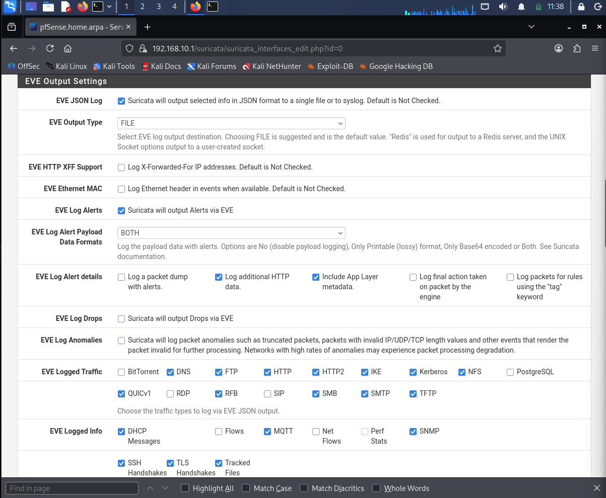 | 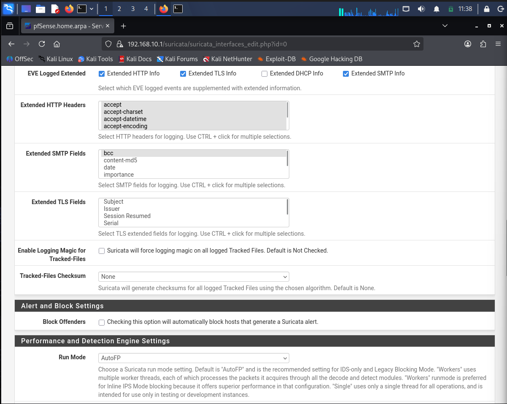 |

| Enabled rulesets (1) | Enabled rulesets (2) |
|---|---|
| 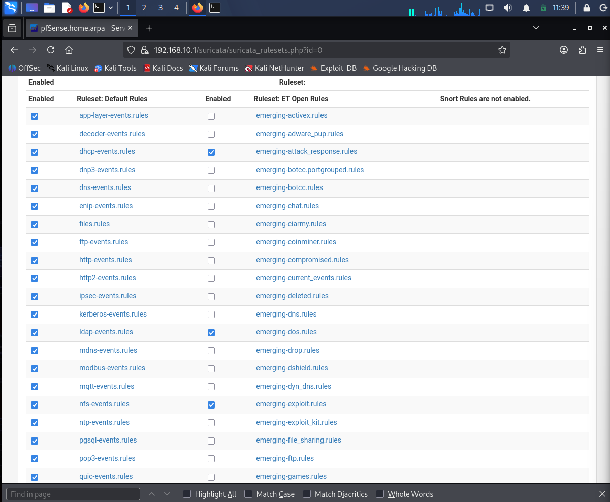 | 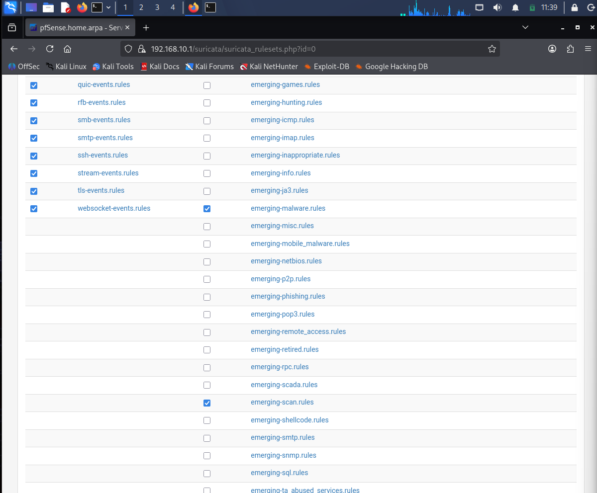 |

Rule update completed successfully:

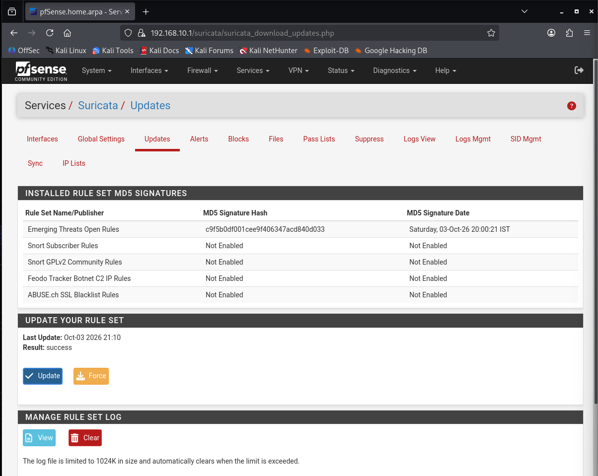

For testing, I temporarily disabled the inter-LAN block rules from the segmentation lab so that traffic from Kali could actually reach the Ubuntu VM:

| LAN rules | LAN2 rules |
|---|---|
| 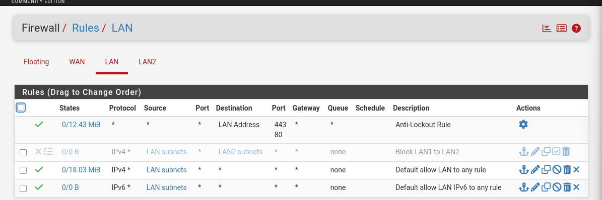 | 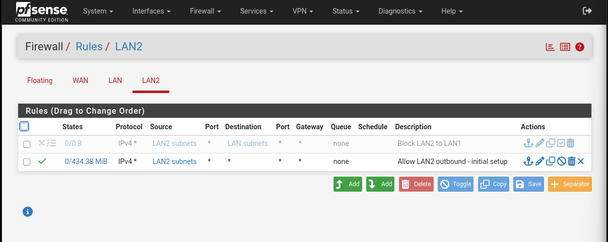 |

## Detection results

**Verification.** Fetching a standard IDS test page from Kali produced `GPL ATTACK_RESPONSE id check returned root` (SID 2100498), which confirmed Suricata was inspecting traffic.

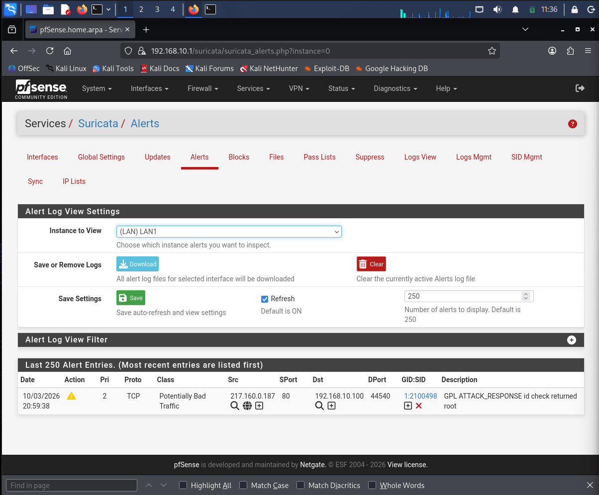

**Scans against pfSense.** `nmap -sV` and `nmap -A` against `192.168.10.1` triggered `ET SCAN Possible Nmap User-Agent Observed` (SID 2024364), 33 alerts in total. pfSense serves HTTP on port 80, and nmap's scripting engine sends a recognizable user agent when it probes web services.

| `nmap -sV` | `nmap -A` |
|---|---|
| 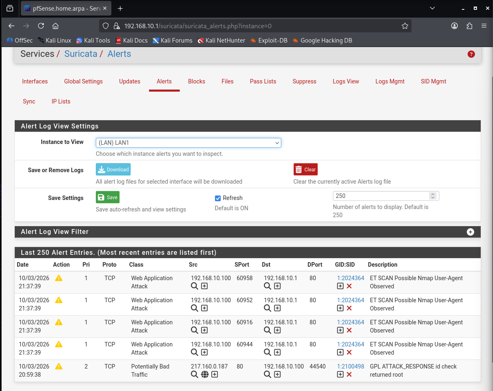 | 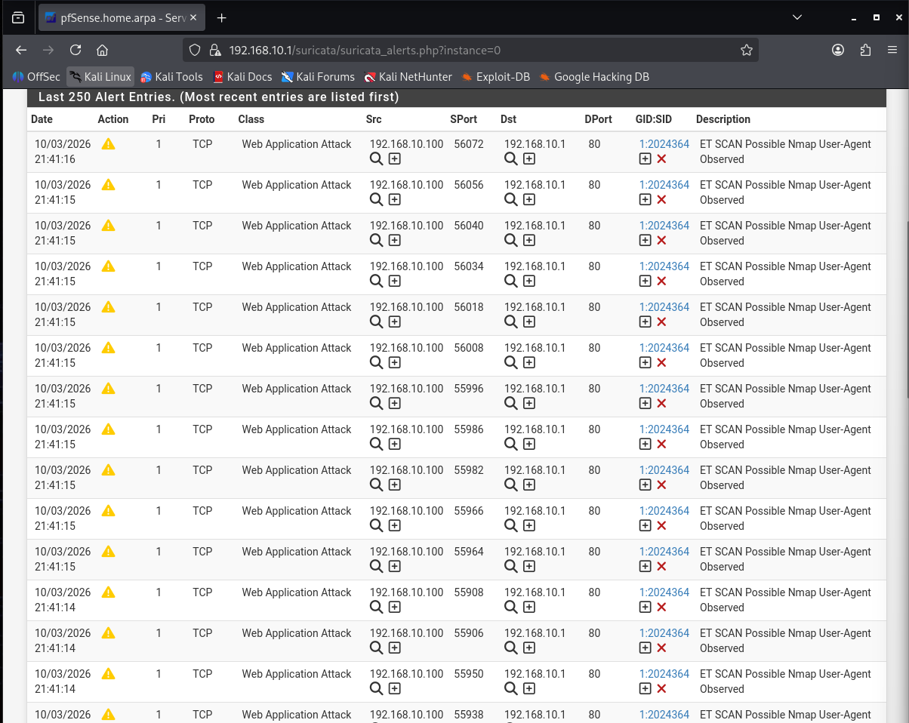 |

**Plain SYN scan.** A basic `nmap -sS` against pfSense produced no alert. None of the rules I had enabled match a plain SYN scan, so it passed through undetected.

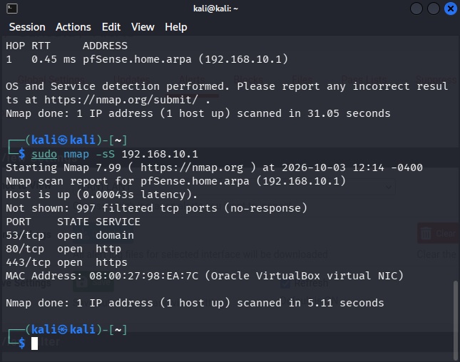

**Scans against Ubuntu.** `nmap -sS` and `nmap -sV` reached the Ubuntu VM (nmap identified OpenSSH), but the LAN2 alerts page stayed empty. The user-agent rule needs an HTTP request and the Ubuntu VM only exposes SSH, so most likely there was nothing for that signature to match. `nmap -A` against Ubuntu produced only the ICMP "unknown code" alerts described under Noise and tuning below.

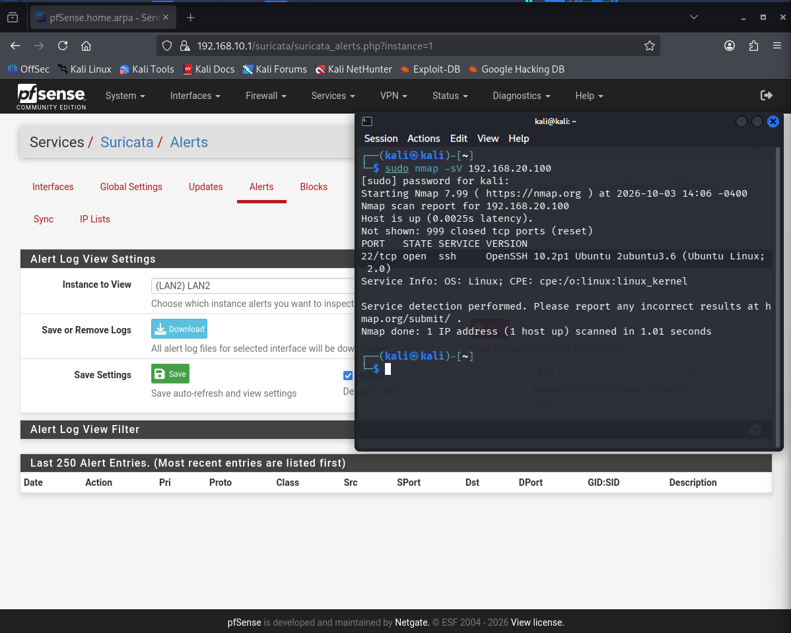

**SSH brute force.** Two hydra runs against Ubuntu's SSH service (5 and 30 passwords) produced no alerts from the default rules.

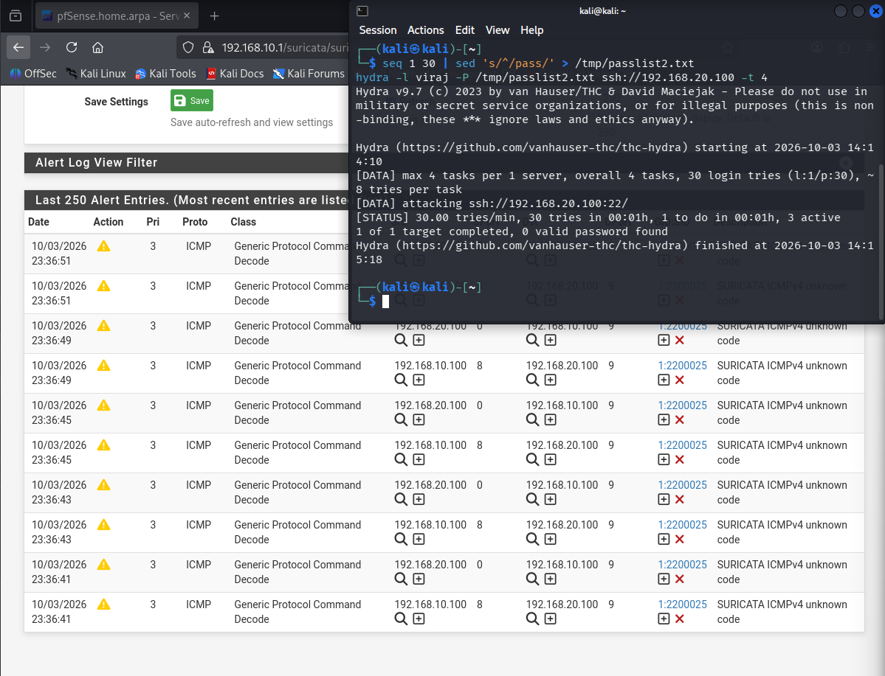

I then added custom rules on LAN2, listed below. They fired, including a threshold rule that alerts when one source opens 5 SSH connections within 60 seconds (priority 1, "Attempted Administrator Privilege Gain").

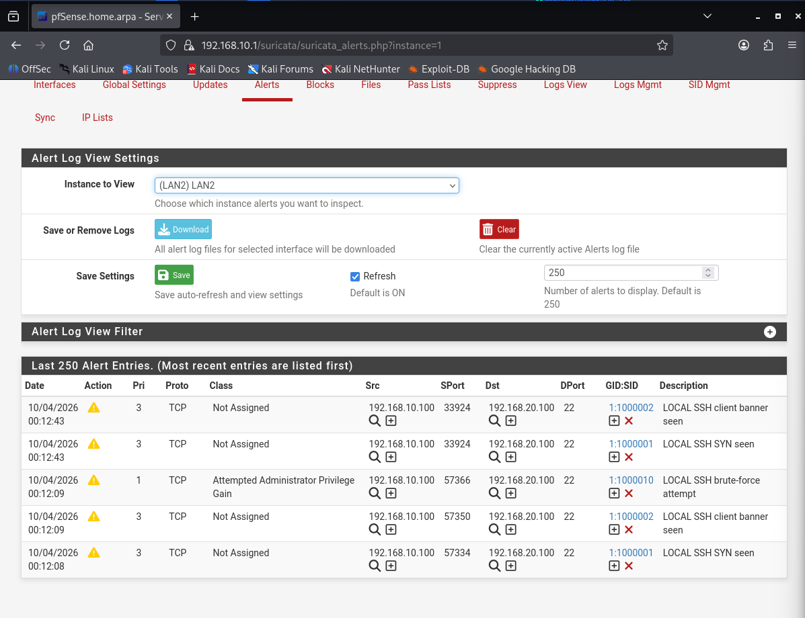

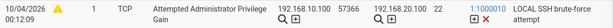

**Custom rules (LAN2)**

```
alert tcp any any -> any 22 (msg:"LOCAL SSH SYN seen"; flags:S; threshold:type limit, track by_src, count 1, seconds 30; sid:1000001; rev:1;)
alert tcp any any -> any 22 (msg:"LOCAL SSH client banner seen"; flow:to_server,established; content:"SSH-2.0"; depth:7; threshold:type limit, track by_src, count 1, seconds 30; sid:1000002; rev:1;)
alert tcp any any -> $HOME_NET 22 (msg:"LOCAL SSH brute-force attempt"; flow:to_server; flags:S; threshold:type both, track by_src, count 5, seconds 60; classtype:attempted-admin; sid:1000010; rev:1;)
```

The first rule only looks at packet headers and the second reads the SSH banner inside an established connection. Together they showed that Suricata could see the traffic and inspect payloads on LAN2.

## Python and SQL analysis

`eve_to_sqlite.py` reads one or more Suricata `eve.json` files, loads the alert events into a SQLite table, and prints summary queries. I ran it against the logs from both interfaces:

```
python3 eve_to_sqlite.py lan1_eve.json lan2_eve.json --db alerts.db
```

It loaded 207 alerts: 168 from LAN (em1) and 39 from LAN2 (em2).

| Signature | SID | Alerts |
|---|---|---|
| SURICATA TCPv4 invalid checksum | 2200074 | 89 |
| SURICATA ICMPv4 unknown code | 2200025 | 74 |
| ET SCAN Possible Nmap User-Agent Observed | 2024364 | 33 |
| LOCAL SSH SYN seen | 1000001 | 4 |
| LOCAL SSH client banner seen | 1000002 | 4 |
| GPL ATTACK_RESPONSE id check returned root | 2100498 | 1 |
| LOCAL SSH brute-force attempt | 1000010 | 1 |
| SURICATA Applayer Detect protocol only one direction | 2260002 | 1 |

| Interface | Destination | Alerts |
|---|---|---|
| em1 (LAN) | 192.168.10.100 | 112 |
| em1 (LAN) | 192.168.10.1 | 36 |
| em2 (LAN2) | 192.168.20.100 | 24 |
| em1 (LAN) | 192.168.20.100 | 20 |
| em2 (LAN2) | 192.168.10.100 | 15 |

Traffic from Kali to Ubuntu crosses both interfaces, so the same activity can appear in both logs. Counts per interface are not additive for that traffic.

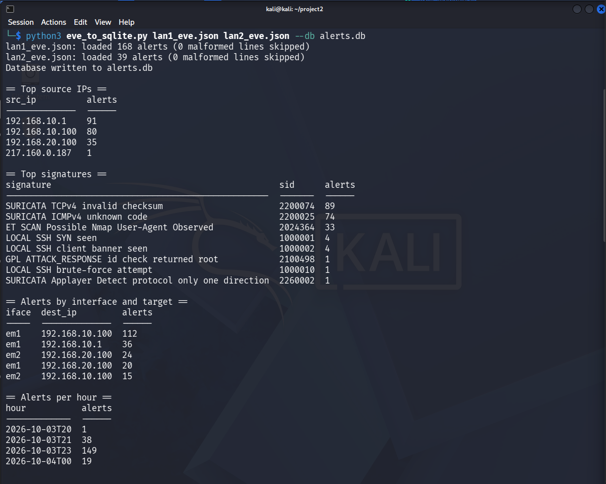

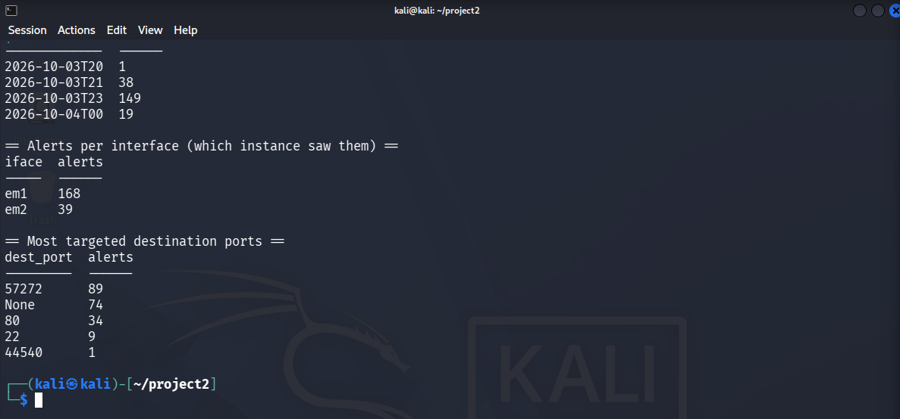

## Noise and tuning

Most of the alert volume was not from the activity I was testing:

- **`SURICATA TCPv4 invalid checksum` (89 alerts):** almost all of it was traffic from pfSense itself (`192.168.10.1`) to a single port on Kali, probably replies in my WebGUI session. This is most likely caused by checksum offload on the virtual NICs. I did not change the offload settings, because the custom payload rules fired correctly.
- **`SURICATA ICMPv4 unknown code` (74 alerts):** the alerts show ICMP echo requests with code 9 and their replies, timed with my `nmap -A` runs. That is consistent with nmap's OS-detection probes, so it is a real, low-priority sign of an `nmap -A` scan, but it adds a lot of volume. I kept it for this analysis. In production I would suppress it or lower its priority.
- **`SURICATA Applayer Detect protocol only one direction` (1 alert):** a protocol-detection event on one of the nmap connections, not an attack signature.

## Attack-by-attack results

_Table coming soon._

## What I learned

- Default rulesets are signature-based, so what they catch depends on the exact tool behavior. A scan that sends HTTP requests was detected, while a plain SYN scan and an SSH brute-force attempt were not.
- Writing a simple threshold rule closed the gap for SSH brute force, and checking it with a header-only rule and a payload rule showed where detection was working.
- Each Suricata instance only sees its own interface, so where the sensor sits changes what gets reported and what gets double counted.
- Raw IDS output is noisy. Summarizing it with SQL made it clear which alerts mattered and which were artifacts of my lab.

## Next steps

- Add a custom threshold rule for port scans, since the enabled rulesets did not flag a plain SYN scan
- Suppress or down-prioritize the noisy signatures above and re-run the analysis
- Try IPS (blocking) mode with a pass list so lab hosts cannot lock themselves out
- Re-enable the inter-LAN block rules and re-test detection with them in place
- Analyze the same traffic at packet level in Wireshark (next project)

## Files

- `eve_to_sqlite.py`: loads Suricata EVE JSON alerts into SQLite and prints summary queries
- `screenshots/`: configuration, alert and script-output evidence referenced above
